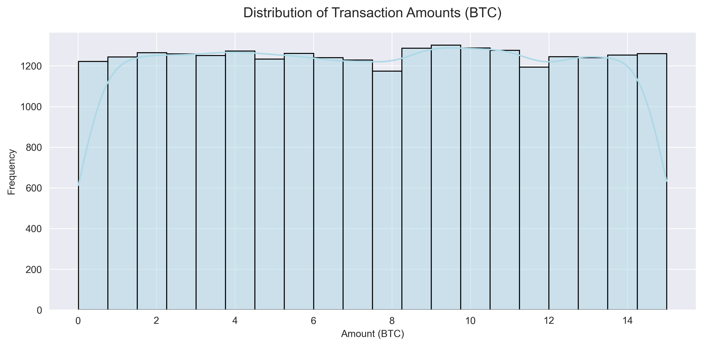
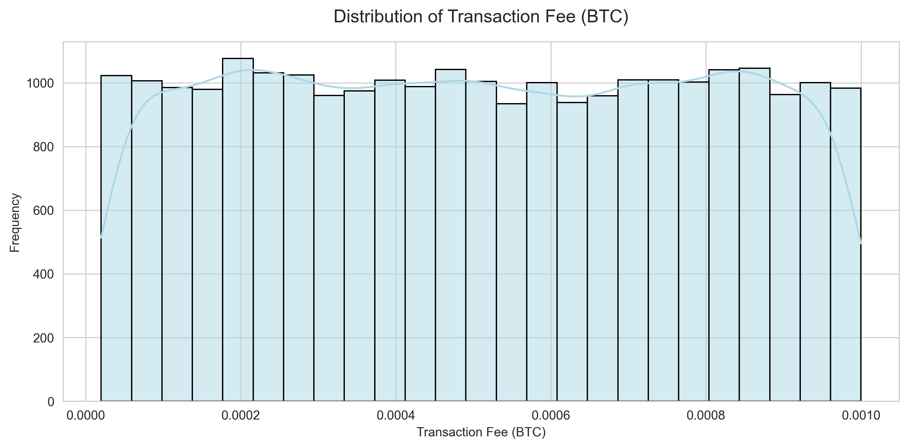
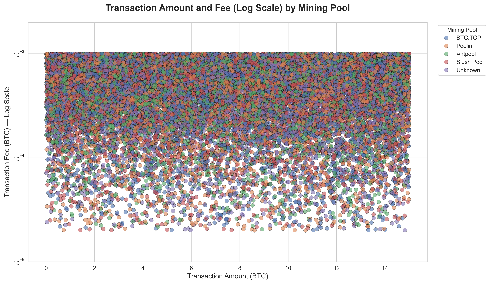
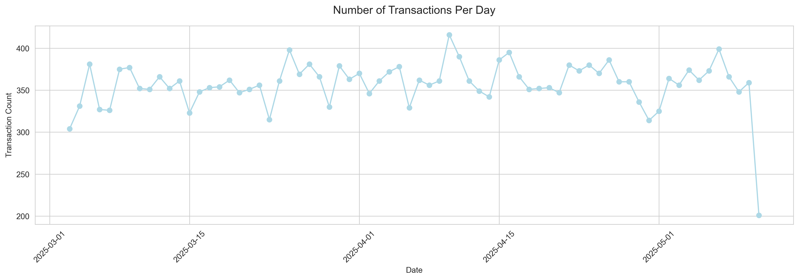
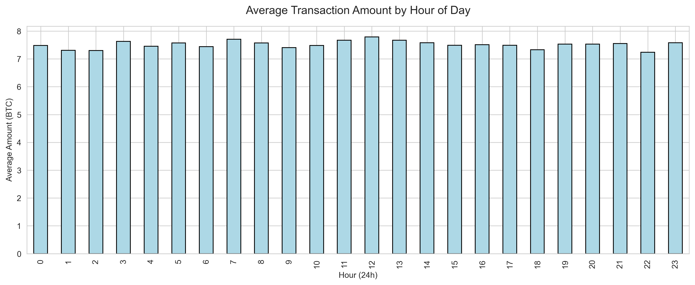
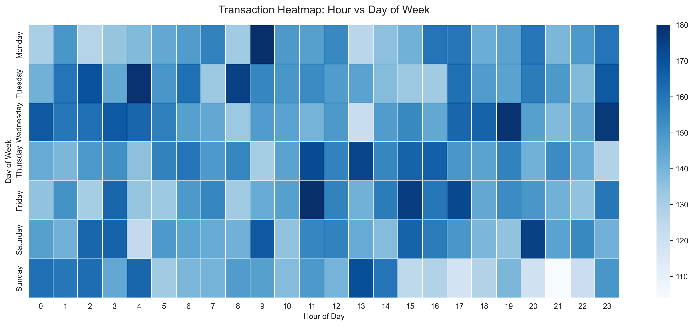
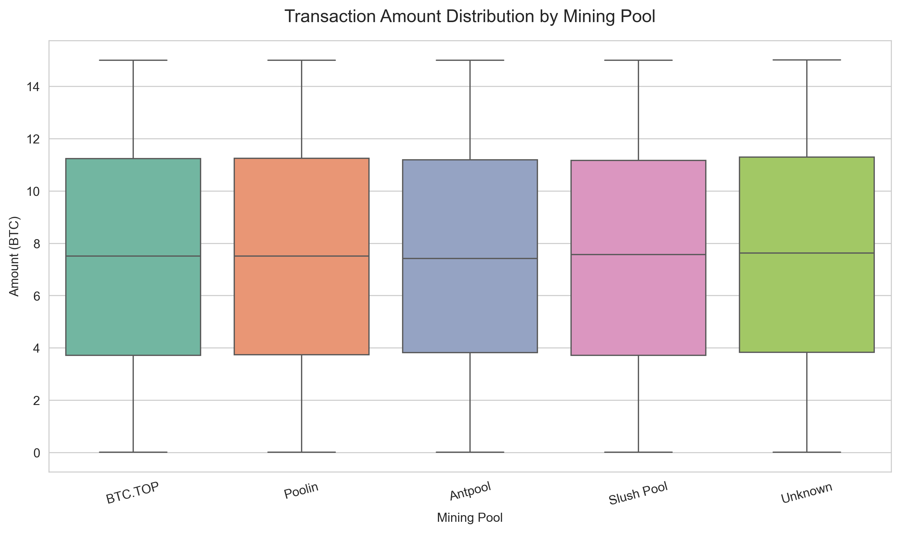
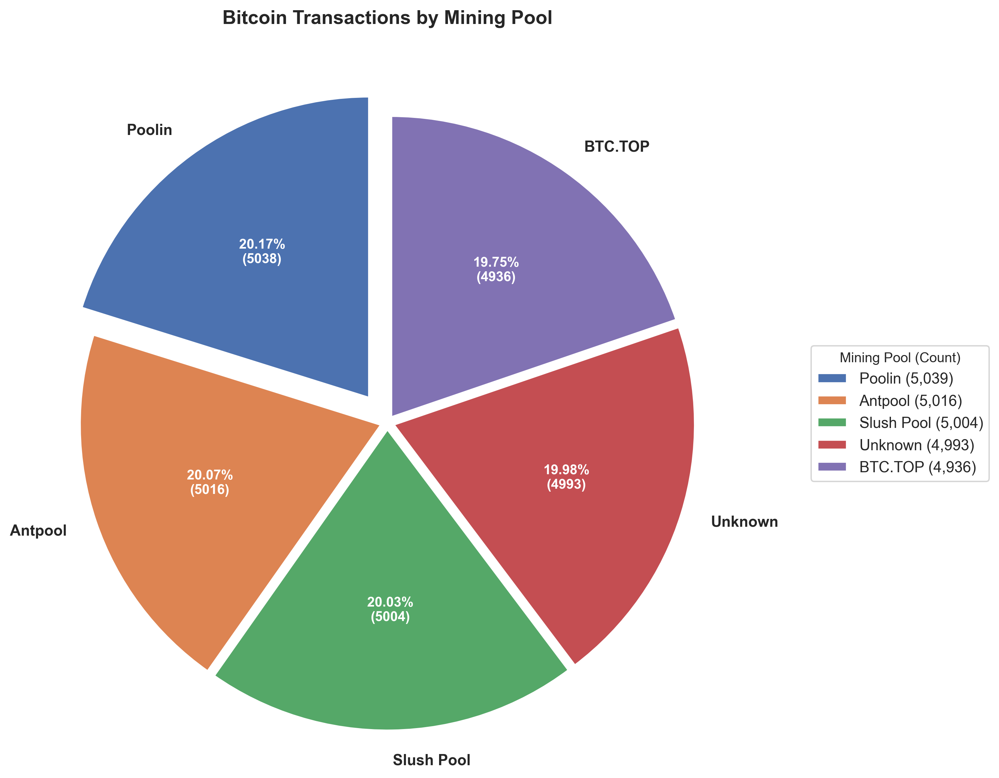

# Exploratory Data Analysis (EDA): Your First Step into Any Dataset
**A Beginner-Friendly Guide with Bitcoin Transactions**

#### Author: Heidi Zhang

---

## What is EDA?

Exploratory Data Analysis (EDA) is the first and often most revealing step in any data science journey. It’s the process of investigating a dataset using summary statistics, visualizations, and pattern detection, all before building models, making predictions, or drawing conclusions. In fact, EDA reveals the distribution and correlation of critical data points right from the start.

> **Think of EDA as "getting to know your data"**, like reading the first few chapters of a book before deciding how the story should be told.

---

## Why Does EDA Matter?

Applying EDA to a dataset lets you understand the data upfront, which prevents the dreaded "garbage in, garbage out" scenario. By truly understanding your data, you can:
- Prepare the data correctly
- Achieve more accurate results
- Choose better models

You cannot assume clean data. That’s why preprocessing steps like replacing missing values and feature engineering are critical to avoid bugs that surface only in later phases.

With a thorough EDA, hidden trends are not missed. It helps you uncover:
- Unexpected patterns
- Surprising relationships
- New hypotheses for further testing

---

## Application of EDA to a Bitcoin Transactions Dataset

Let’s explore a public dataset from Kaggle: [Crypto Transactions in 2025 (March to May)](https://www.kaggle.com/datasets/1d41488c491d73c3f539f931157b4ee76c60ded7733701ab4104bf2fc0239834). This dataset contains detailed records of cryptocurrency transactions, focusing on **Bitcoin (BTC)** and **Ethereum (ETH)**.

Bitcoin is often considered simpler and safer for a beginner’s first dive into crypto. Ethereum, by contrast, is inherently more complex—designed as a programmable platform, with complexity most visible in **Gas Prices** and **Smart Contracts**. Since this is a beginner’s guide, we’ll focus exclusively on Bitcoin.

---

### Step 1 – Data Overview & Preprocessing

The original dataset has 12 features. One column identifies whether a transaction is Bitcoin or Ethereum, so we split a subset dedicated to Bitcoin—our focus for this analysis.

#### Data Quality Checks
- Bitcoin doesn’t use gas, so gas price values are missing. We replace them with zeros.
- A few features have only one unique value across all rows—they won’t contribute to analysis, so we drop them.
- The `Timestamp` column is converted to datetime, then split into useful features, `Date`, `Hour`, and `DayOfWeek`.

#### Helpful Data Fields (Columns)
| Column | Type | Description |
|-------|------|-------------|
| `Transaction_ID` | String | A unique identifier for each cryptocurrency transaction |
| `Sender_Address` | String | The blockchain address of the sender |
| `Receiver_Address` | String | The blockchain address of the recipient |
| `Amount` | Float | The total amount of cryptocurrency transferred (in BTC) |
| `Transaction_Fee` | Float | The fee paid to process the transaction |
| `Timestamp` | Datetime (ISO 8601) | The date and time when the transaction was processed |
| `Block_ID` | String | The unique identifier for the block that included the transaction |
| `Mining_Pool` | String | The name of the mining pool that confirmed the transaction |

#### Statistical Summary (Bitcoin Transactions Only)
```plaintext
             Amount       Transaction_Fee
count         24,988            24,988
mean          7.514487          0.000509
std           4.323360          0.000284
min           0.010101          0.000020
25%           3.764435          0.000261
50%           7.519939          0.000506
75%          11.224507          0.000756
max          14.999943          0.001000
```

#### First Impressions
- Amounts vary from tiny to large, and most transactions are around 7–8 BTC.
- Fees are very small and highly consistent.

### Step 2 – Ask Basic Questions
Now, let’s turn observations into actionable questions:

1. How much Bitcoin is moving daily?
2. How much are people paying in fees?
3. Does a higher amount cause higher transaction fees? 
4. What’s the average transaction amount in each hour of the day? 
5. How many transactions occur per day? 
6. Do transactions cluster at certain times or dates? 
7. Is the transaction amount related to the mining pool? 
8. What’s the frequency of each mining pool?

### Step 3 – Visualization and Observations
Graphical representations uncover patterns and anomalies. Choosing the right chart is crucial for communicating insights clearly.

#### Transaction Amount and Fees Analysis

`Amount` is a continuous numerical variable, so a histogram is ideal (not a bar chart). Histograms shows shape, spread, central tendency, etc.
The same reason histogram is used for `Transaction_Fee`.





Observation:
- Amounts are evenly spread—no strong clustering. This suggests a mix of personal, business, and institutional transfers.
- Fees are tiny and consistent, tightly clustered around 0.0005 BTC.

Scatter plots show relationships between two continuous variables, so we use one to explore transaction amount and fee.


Observation:
- There is no relationship between amount and fee. A 5-BTC transfer may pay the same fee as a 1-BTC transaction.
Because Bitcoin fees depend on data size and network congestion, not value. A simple transfer means low fee.
In addition, other factors influencing fees include urgency and transaction type.

#### Date and Time Analysis

Line charts show trends over time, which is ideal for daily transaction counts.



Observation:
- Daily count fluctuates between 300 and 400 and no strong upward or downward movement over two months. 
- Around April 10th–12th, exceeding 400 transactions. Check for major Bitcoin news, regulatory events, or price volatility on those dates. 
- Minimal variation by month, day, or hour - consistent with Bitcoin’s decentralized, 24/7 nature.


Observation:
- Average amount stays consistently high, between 7.2 and 7.7 BTC.
- Overall average: about 7.5 BTC.
- A note to readers who would like more information from such a chart: larger average amounts at certain hours may correlate with higher fees, suggesting users pay to jump the queue. The characteristics of a similar chart can help identify automation and bots when there is high activity at specific hours (e.g., 0, 6, 12 UTC), as they often signal scheduled scripts. 


A heatmap visualizes the intensity of a phenomenon across two categorical or ordered variables, emphasizing transaction activities by hour and day of the week.


Observation:
- Overall, the colors appear darker across Monday through Friday than on the weekend. This is a common pattern for financial assets, indicating higher participation from institutional traders or those who treat Bitcoin like a traditional market asset. 
- The two-peak pattern (morning and afternoon) during the weekdays suggests that Bitcoin transactions, despite the 24/7 nature of crypto, are heavily influenced by the opening and closing of traditional stock markets. 

#### Mining Pool Analysis
Boxplot summarizes distribution of a continuous variable across categories. Pie chart shows proportions for a small number of categories.
We analyze mining pools using both.




Observation:
- Five pools account for 100% of sampled blocks and each handles ~20% of transactions. 
- Near-equal split is a positive signal: no single entity dominates block production.
- An analyst should know that mining pools control transaction validation and new block creation, as their distribution affects fee dynamics and decentralization. 

--- 

## Potential Next Steps
The dataset used in this analysis, despite its high rating on Kaggle and a label asserting 100% credibility, exhibited a few data quality red flags during inspection, including clear instances of mis-labeled columns. Due to time constraints, I was unable to perform a full validation.

To maintain transparency and avoid misleading readers, it is crucial to acknowledge these concerns. Moving forward, I propose that emerging privacy-preserving cryptographic techniques, such as Zero-Knowledge Proofs (ZKP), hold promise in the near future for verifying the trustworthiness of public datasets. 

For those interested in expanding this work, the next steps for EDA could include:

- Anomaly Detection: checking for and investigating unusual data points, such as high-fee outliers.

- Deeper Analysis & Visualization: visualizing temporal trends using time series plots and potentially modeling transaction fees or amounts.

- Network Analysis: analyzing specific wallet addresses to identify patterns among repeat senders and receivers.

- Feature Engineering: before applying machine learning models, categorical features like `Mining_Pool` should be converted into numerical representations, typically via one-hot encoding.

--- 

## Conclusion: EDA Is Not Optional — It’s Essential
EDA is the compass and foundation of any reliable data science project. Far more than a routine data-cleaning step, it illuminates the dataset by exposing its structure, uncovering hidden issues, and revealing subtle patterns long before modeling begins.

This analysis has walked through the core steps of EDA using real Bitcoin transactions, showing how even a beginner with Pandas can extract meaningful insights from complex data. Whether you're a novice building your first notebook or a blockchain analyst decoding crypto flows, remember that the journey should always begin with rigorous EDA.

t is the critical intersection where curiosity meets clarity, and where a skeptical, investigative mindset transforms raw, messy data into trustworthy, actionable insights.
Start with EDA and you set yourself on the path to genuinely informed decisions.